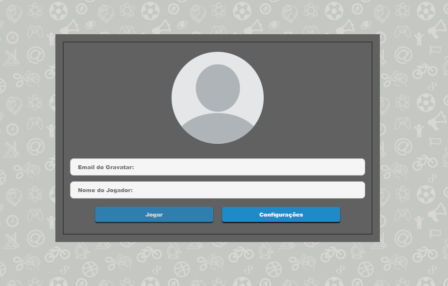

<h1 align="center">Jogo Trivia</h1>

<p align="center">Esse projeto é uma jogo de perguntas e respostas.</p>

<p align="center">
 <a href="#features">Features</a> •
 <a href="#Node">Node</a> •
 <a href="#rodando-o-mobile">Rodando a aplicação</a> •
 <a href="#Docker">Docker</a> •
 <a href="#tecnologias">Tecnologias</a> •
 <a href="#autor">Autor</a>
</p>

[](https://app.circleci.com/pipelines/github/HigorAnjos/triviaApp)


---

### Telas

<h1 align="center">
  
  <!--  -->
</h1>

---
## Node

### Pré-requisitos

Antes de começar, você vai precisar ter instalado em sua máquina as seguintes ferramentas:
[Git](https://git-scm.com), [Node.js](https://nodejs.org/en/).


Você também vai precisar configurar o ambiente para desenvolvimento mobile no seu PC: [Configurando Ambiente React Native](https://react-native.rocketseat.dev/).

Além disto é bom ter um editor para trabalhar com o código como [VSCode](https://code.visualstudio.com/)

---

### Rodando o Trivia

```bash
# Clone este repositório
$ git clone https://github.com/ARTHURPC03/WeatherApp

# Acesse a pasta do projeto no terminal/cmd
$ cd WeatherApp

# Faça uma cópia de '.env.example' para '.env'
# Coloque sua credencial da API de clima (Weather API)
$ cp .env.example .env

# Instale as dependências
$ yarn

# Se você for emular com o Android, execute este comando
# Certifique-se de ter o emulador aberto
$ yarn android

# Se você for emular com ios, execute este comando
$ yarn ios
```


## Docker

### Pré-requisitos

Antes de começar, você vai precisar ter instalado em sua máquina as seguintes ferramentas:
[Git](https://git-scm.com), [Node.js](https://nodejs.org/en/).


Você também vai precisar configurar o ambiente para desenvolvimento mobile no seu PC: [Configurando Ambiente React Native](https://react-native.rocketseat.dev/).

Além disto é bom ter um editor para trabalhar com o código como [VSCode](https://code.visualstudio.com/)

---

### Rodando o Trivia

```bash
# Clone este repositório
$ git clone https://github.com/ARTHURPC03/WeatherApp

# Acesse a pasta do projeto no terminal/cmd
$ cd WeatherApp

# Faça uma cópia de '.env.example' para '.env'
# Coloque sua credencial da API de clima (Weather API)
$ cp .env.example .env

# Instale as dependências
$ yarn

# Se você for emular com o Android, execute este comando
# Certifique-se de ter o emulador aberto
$ yarn android

# Se você for emular com ios, execute este comando
$ yarn ios
```


## Tecnologias

As seguintes ferramentas foram usadas na construção do projeto:

- [TypeScript](https://www.typescriptlang.org/)
- [React Native](https://reactnative.dev/)
- [Weather API](https://openweathermap.org/api)
- [Context API](https://pt-br.reactjs.org/docs/context.html)
- [React Native Geolocation Service](https://github.com/Agontuk/react-native-geolocation-service)
- [React Navigation](https://reactnavigation.org/)
- [React Native Vector Icons](https://github.com/oblador/react-native-vector-icons)
- [UnForm](https://unform.dev/)
- [Yup](https://github.com/jquense/yup)
- [Styled Components](https://styled-components.com/)
- [Axios](https://github.com/axios/axios)
- [Eslint](https://eslint.org/)
- [Prettier](https://prettier.io/)
- [EditorConfig](https://editorconfig.org/)


---

Trabalho desenvolvido na trybe com finalidade didatica, feito em grupo.

[Gabriel Julio](https://github.com/GJTrybe)

[Leonardo Mendonça](https://github.com/leobmend)

[Github Pages](https://higoranjos.github.io/triviaApp/)
